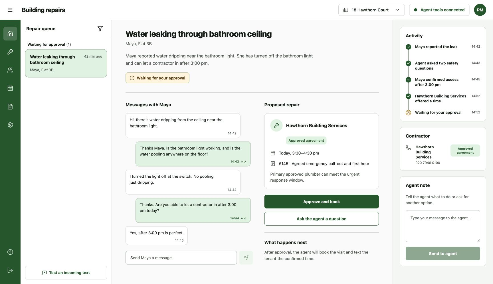

# Building Repairs

Building Repairs is an SMS-first rental-maintenance coordinator. Tenants report problems by text, a browser agent can triage the case and prepare a contractor visit through WebMCP, and the property manager approves the cost and booking from one dashboard.



## What works

- inbound SMS webhook for JSON test messages and Twilio form payloads
- one persistent repair record containing messages, access, proposal, approval, appointment, and activity
- local JSON storage with atomic writes
- real Twilio outbound delivery when credentials are present, with a local outbox fallback for development
- manager approval gate enforced by the server before booking
- building-specific preferred contractor agreements with ordered backups and agreed prices
- auditable contractor-unavailability attempts and server-guarded external fallback
- responsive property-manager dashboard with a development-only SMS simulator
- WebMCP tools for listing, reading, triaging, messaging, proposing, and booking approved repairs

Manager approval is deliberately not a WebMCP tool. The browser agent can prepare a solution, but the human approves the cost in the dashboard before the booking tool can succeed.

## Run locally

Requirements: Node.js 20 or newer.

```bash
npm install
npm run dev
```

The dashboard is served by Vite (normally `http://localhost:5173`) and the API runs at `http://localhost:8787`. If the Vite port is occupied, use the alternate URL printed in the terminal.

Useful checks:

```bash
npm test
npm run build
```

Without Twilio credentials, outbound texts are recorded at `GET /api/outbox`. Use “Test an incoming text” in the development dashboard to exercise the same webhook path a phone provider uses.

## Connect Twilio

Copy `.env.example` values into your runtime environment:

```text
TWILIO_ACCOUNT_SID=...
TWILIO_AUTH_TOKEN=...
TWILIO_PHONE_NUMBER=...
```

Configure the Twilio number’s incoming-message webhook as:

```text
POST https://YOUR_HOST/api/sms/inbound
```

The endpoint accepts Twilio’s `application/x-www-form-urlencoded` payload and returns an empty TwiML response. Signature verification, dashboard authentication, encrypted production storage, rate limiting, and a non-development outbox policy must be added before handling real tenant data.

## WebMCP surface

The dashboard registers these tools when the browser exposes the WebMCP producer API:

- `list_open_repairs`
- `get_repair_case`
- `get_contractor_path`
- `triage_repair`
- `send_tenant_message`
- `propose_preferred_contractor_visit`
- `record_preferred_contractor_unavailable`
- `start_external_contractor_search`
- `propose_external_contractor_visit`
- `book_approved_visit`

The preferred route takes contractor identity and price from the stored agreement. An agent cannot skip the primary agreement, claim a manager requested fallback, or add an external quote before the server authorizes external search.

The implementation feature-detects the current `document.modelContext` API and the deprecated `navigator.modelContext` compatibility surface. If neither is present, the dashboard says “Browser agent tools unavailable.” There is no fake connected state and no production polyfill.

The current product proves the shared case workflow and browser-agent action surface. A continuously running background agent that reacts to every SMS while no WebMCP-enabled browser session is connected is not yet implemented.

## Architecture

```text
tenant SMS ──> /api/sms/inbound ──> repair store ──> manager dashboard
                                         ▲                 │
                                         │                 │ WebMCP tools
                                         └── workflow API <┘
                                                │
                                                └──> Twilio or local outbox
```

- `src/server`: webhook, workflow API, persistence, and SMS delivery
- `src/server/contractor-selection.ts`: agreement priority, attempts, and external-search policy behind one domain interface
- `src/client`: React dashboard and WebMCP registration
- `src/shared`: repair-domain types
- `PRODUCT.md`: product boundaries
- `DESIGN.md`: Impeccable design system and UI guardrails
- `docs/adr`: architectural decisions

## Safety invariant

Booking is a server-side state transition, not a UI convention. A repair must have a contractor proposal and explicit property-manager approval before `book` succeeds. Tests cover the blocked and successful paths.
